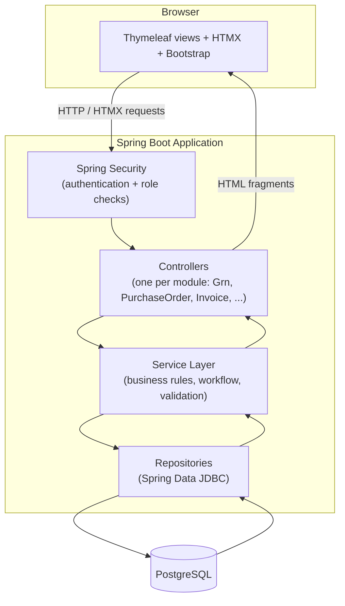
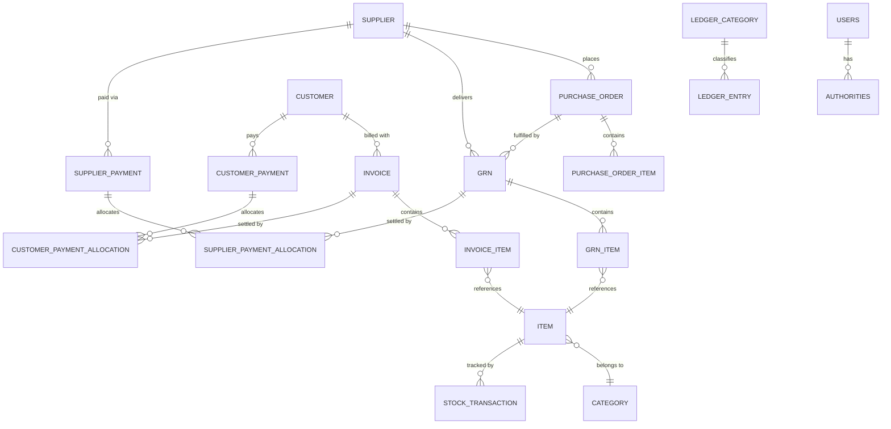
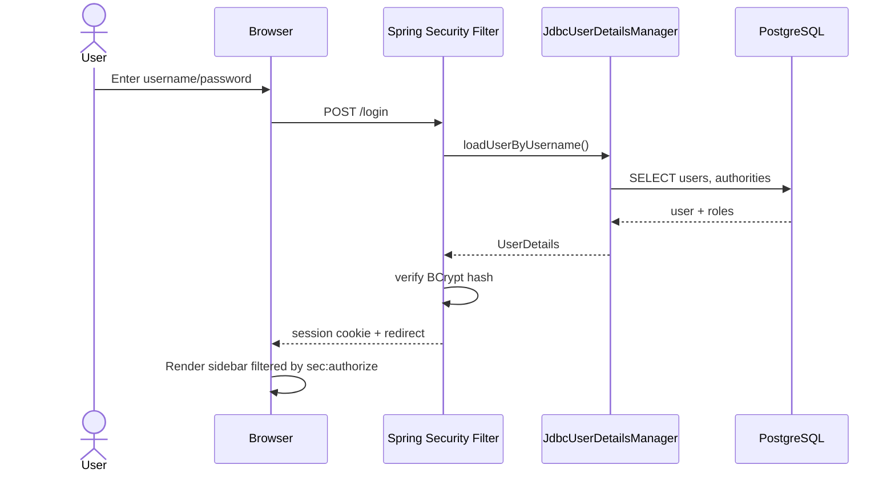
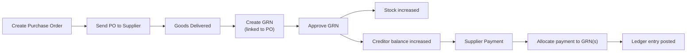
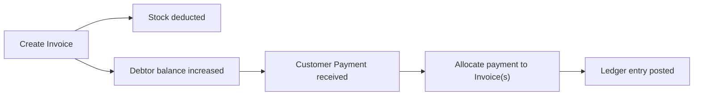
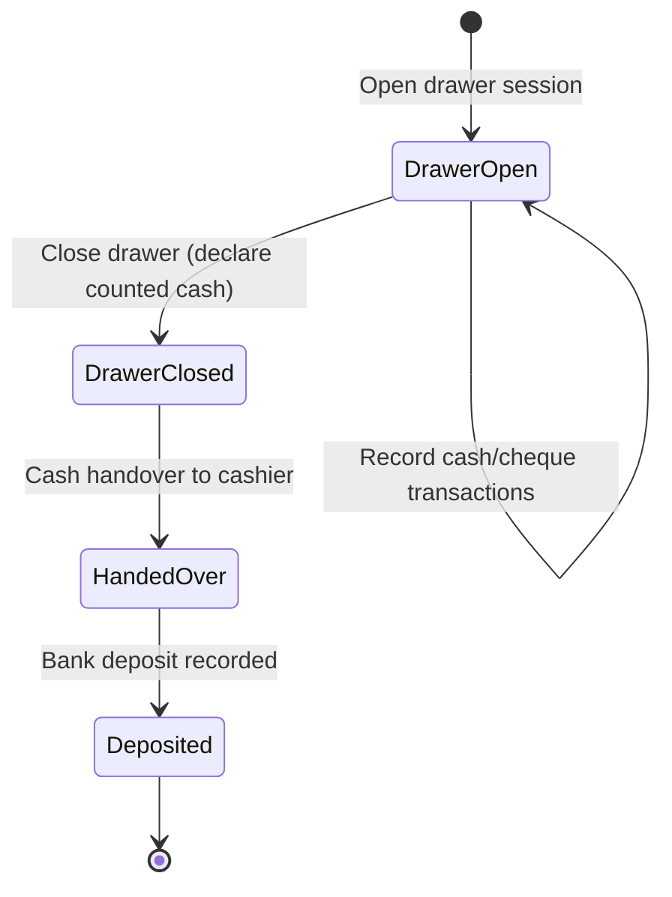

<!--
  VIVA PRESENTATION — 3R Marketing / SalesManager4
  =================================================
  This file is written in Marp markdown (https://marp.app).

  How to present it:
    - VS Code: install the "Marp for VS Code" extension, open this file,
      click the preview icon top-right, then "Export Slide Deck" (PDF/PPTX/HTML).
    - CLI: npx @marp-team/marp-cli viva-presentation.md -o viva-presentation.pdf

  Mermaid diagrams:
    - GitHub and VS Code's built-in Markdown preview render the ```mermaid```
      blocks below natively.
    - Marp's default renderer does NOT render Mermaid out of the box. Before
      the viva, either (a) enable a Mermaid-capable Marp engine/plugin, or
      (b) paste each mermaid block into https://mermaid.live, export it as a
      PNG/SVG, and drop the image in place of the code block (same folder,
      e.g. diagrams/architecture.png).

  Screenshots:
    - Every slide that needs a screenshot has a placeholder line like:
        > 🖼️ **Screenshot placeholder:** short description
      Replace the placeholder with a real image once you have one, e.g.:
        

  Placeholders you must fill in before presenting:
    [Your Name], [Registration/Index No.], [Degree/Programme], [Institution],
    [Supervisor Name], [Viva Date]
-->

<!-- _class: lead -->

# 3R Marketing
## Integrated Sales, Inventory & Finance Management System

A Spring Boot web application for end-to-end retail/distribution operations —
purchasing, inventory, sales, cash, and accounting in one place.

**[Your Name]**
[Degree/Programme], [Institution]
Supervisor: [Supervisor Name]
[Viva Date]

---

# Agenda

1. Introduction & Motivation
2. Problem Statement & Objectives
3. Scope & Key Modules
4. Technology Stack & Architecture
5. Database Design
6. Security & Role-Based Access
7. Module Walkthrough (with workflows)
8. Testing Strategy
9. Challenges & Solutions
10. Future Enhancements
11. Conclusion & Demo

---

# Introduction & Background

- Small/medium distribution businesses (e.g. FMCG marketing companies) run
  **purchasing, inventory, sales, and cash accounting** as separate manual
  processes — spreadsheets, paper GRNs, notebooks for cash handovers.
- This disconnect causes **stock discrepancies, delayed supplier payments,
  and no single source of truth for cash/ledger position**.
- **3R Marketing** (project codename `salesmanager4`) is a single web
  application that digitizes this entire chain for a real business.

> 🖼️ **Screenshot placeholder:** application landing / dashboard screen

---

# Problem Statement

Manually run distribution businesses typically struggle with:

- No real-time visibility of **stock levels** across categories/items.
- No traceable link between a **Purchase Order → Goods Received → Payment**.
- **Supplier and customer balances** (creditors/debtors) tracked ad-hoc,
  making aging/follow-up difficult.
- **Cash handled by multiple salesmen/cashiers** with no reconciliation
  workflow (drawer sessions, handovers, deposits).
- No **audit trail** — anyone can act as anyone; no role separation.

---

# Objectives

- Build a **single web system** covering procurement → inventory → sales →
  finance for a distribution business.
- Model **Purchase Orders, GRNs, Invoices and Payments** as linked,
  traceable documents (not free-standing records).
- Maintain **creditor/debtor ledgers** with allocation of payments against
  specific GRNs/invoices, and aging reports.
- Provide a **cash balancing workflow** (drawer sessions, handovers,
  deposits) for multi-user cash accountability.
- Enforce **role-based access control** so each user only sees/does what
  their job requires.
- Generate **exportable reports** (CSV/PDF) for management and audit.

---

# Scope & Key Modules

| Area | Modules |
|---|---|
| Master Data | Users & Roles, Employees, Suppliers, Customers, Item Categories |
| Inventory | Items, Stock Transactions |
| Procurement | Purchase Orders, Goods Received Notes (GRN) |
| Sales | Invoicing, Promotions, Retailers |
| Finance — Payables | Supplier Payments, Creditors & Aging |
| Finance — Receivables | Customer Payments, Debtors & Aging |
| Cash | Cash Transactions, Cheques, Drawer Sessions, Handovers, Cash Balancing |
| Accounting | General Ledger (income/expense categories & entries) |
| Reporting | Dashboard KPIs, Report Builder (CSV/PDF export) |

---

# Technology Stack

- **Language / Runtime:** Java 21
- **Framework:** Spring Boot 4.1 (Spring MVC, Spring Security, Spring Boot Actuator)
- **Data Access:** Spring Data **JDBC** (not JPA) over **PostgreSQL**
- **Web / UI:** Thymeleaf server-side templates + **HTMX** for partial-page
  updates (no SPA framework) + Bootstrap 5
- **Security:** Spring Security with `JdbcUserDetailsManager`, BCrypt
  password hashing, Thymeleaf `sec:authorize` for role-based UI gating
- **Reporting:** OpenHTMLtoPDF (HTML → PDF), custom CSV export
- **Build:** Maven

---

# Why This Stack?

- **Thymeleaf + HTMX over a JS SPA:** server renders HTML fragments, HTMX
  swaps them in — simpler mental model, fewer moving parts, works well for
  a forms-and-tables business app, less client-side state to manage.
- **Spring Data JDBC over JPA/Hibernate:** explicit, predictable SQL and
  aggregate boundaries — avoids lazy-loading/N+1 surprises for
  finance-critical read paths (ledgers, aging reports).
- **PostgreSQL:** strong transactional guarantees for money-moving
  operations (payments, allocations, stock updates).
- **Schema is hand-maintained SQL** (`schema.sql`), applied incrementally —
  gives full control over constraints/indexes for financial integrity.

---

# High-Level Architecture



---

# Package Structure

Each business area is an isolated package with its own controller,
service, repository and view templates:

```
com.example.salesmanager4
 ├─ users/          suppliers/        purchase_order/
 ├─ employees/      customers/        grn/
 ├─ inventory/      invoice/          finance/
 │   ├─ category/                      ├─ ledger/
 │   ├─ item/                          └─ payments/
 │   └─ stock/                              ├─ payable/ (supplier payments)
 ├─ cash/                                   ├─ receivable/ (customer payments)
 │   └─ balancing/                          ├─ creditors/
 ├─ reports/                                └─ debtors/
 ├─ dashboard/      promotion/        retailers/
```

---

# Database Design — Overview

25 tables, grouped by business concern:

- **Identity:** `users`, `authorities`
- **Catalogue:** `category`, `item`, `stock_transaction`
- **People:** `employee`, `supplier`, `customer`
- **Procurement:** `purchase_order`, `purchase_order_item`, `grn`, `grn_item`
- **Sales:** `invoice`, `invoice_item`
- **Payables:** `supplier_payment`, `supplier_payment_allocation`,
  `creditor_transaction`
- **Receivables:** `customer_payment`, `customer_payment_allocation`
- **Cash:** `cash_transaction`, `cheque_transactions`, `cash_handover`,
  `cash_handover_deposit`, `cash_drawer_session`
- **Accounting:** `ledger_category`, `ledger_entry`

---

# Entity-Relationship Diagram



---

# Security Model

- **Spring Security** filter chain, form login (`/login`), BCrypt-hashed
  passwords, session-based authentication.
- **`JdbcUserDetailsManager`** backs authentication directly off the
  `users` / `authorities` tables — no separate identity service needed.
- Roles currently defined: **ADMIN, HR, MANAGER, STOREKEEPER, CLERK,
  SALESMAN, CASHIER**.
- Two layers of enforcement:
  1. **URL-level** in `SecurityConfig` (e.g. `/users` requires `ROLE_ADMIN`).
  2. **UI-level** via Thymeleaf `sec:authorize` — sidebar links only render
     for roles permitted to use that module.

> 🖼️ **Screenshot placeholder:** login page

---

# Login Sequence



---

# Role → Module Access (in progress)

Access is being rolled out module-by-module (`sec:authorize` on nav links);
today's enforced matrix:

| Module | ADMIN | HR | MANAGER | STOREKEEPER | CLERK | SALESMAN | CASHIER |
|---|:---:|:---:|:---:|:---:|:---:|:---:|:---:|
| Users (create/manage) | ✅ | | | | | | |
| Employees | ✅ | ✅ | ✅ | | | | |
| Suppliers | ✅ | | ✅ | ✅ | ✅ | ✅ | |
| Everything else (GRN, PO, Invoice, Cash, Ledger, Reports, …) | ✅ | Open to all authenticated users — matrix being extended | | | | | |

> Remaining modules are next in line for the same `hasAnyRole(...)` treatment
> as Users/Employees/Suppliers above.

---

# Module: Dashboard

- Landing page after login — quick-glance KPIs pulled via
  `DashboardRepository` (e.g. stock value, outstanding receivables/payables,
  today's cash position).
- Sidebar navigation (role-filtered) to every module lives here.

> 🖼️ **Screenshot placeholder:** dashboard with KPI cards

---

# Module: Inventory Management

- **Categories** organise **Items**; each item tracks quantity via
  **Stock Transactions** (in/out ledger, not a single mutable counter —
  gives a full audit trail of stock movement).
- Stock increases automatically when a GRN is approved, decreases when an
  invoice is issued.

> 🖼️ **Screenshot placeholder:** item list / stock view

---

# Module: Supplier Management

- Supplier master data feeds **Purchase Orders**, **GRNs**, and
  **Supplier Payments**.
- Restricted to ADMIN, MANAGER, STOREKEEPER, CLERK, SALESMAN roles.

> 🖼️ **Screenshot placeholder:** supplier list / detail page

---

# Module: Purchase Orders

- Create a PO against a supplier with line items (`PurchaseOrderItem`).
- A PO is the **origin document** for procurement — it is later linked to
  one or more GRNs when goods actually arrive.

> 🖼️ **Screenshot placeholder:** purchase order create/edit screen

---

# Module: Goods Received Notes (GRN)

- Recently linked directly to its originating **Purchase Order**
  (traceability: PO → GRN).
- Workflow: **create → edit → approve** (`GrnController`
  `/grn/{id}/approve`) — approval is the point where stock and creditor
  balances are actually updated.
- Line items (`GrnItem`) recorded per delivered product.

> 🖼️ **Screenshot placeholder:** GRN detail/approval screen

---

# Procure-to-Pay Workflow



---

# Module: Customers & Invoicing

- Customer master data drives **Invoices**, each with line items
  (`InvoiceItem`) referencing catalogue items.
- Issuing an invoice deducts stock and increases the customer's
  outstanding (debtor) balance.
- Invoices can be exported/printed as PDF via OpenHTMLtoPDF.

> 🖼️ **Screenshot placeholder:** invoice creation screen

---

# Module: Customer Payments & Receivables

- **Customer Payments** are recorded against a customer, then
  **allocated** to specific outstanding invoices
  (`CustomerPaymentAllocation`) — supports partial payments and
  overpayment/credit tracking.
- Supports multiple **payment instruments** (cash, cheque, etc.) and
  directions (`PaymentType`, `PaymentInstrument`, `PaymentDirection`).

> 🖼️ **Screenshot placeholder:** customer payment / allocation screen

---

# Order-to-Cash Workflow



---

# Creditors & Debtors — Aging

- **Creditors module:** supplier outstanding balances, unallocated
  credits/refunds, and GRN-level outstanding — with supplier **aging**
  buckets (`SupplierAging`).
- **Debtors module:** mirror functionality for customers
  (`CustomerAging`, `CustomerOutstandingInvoice`, unallocated
  credits/refunds).
- Both let finance staff see exactly **who owes what, and for how long**.

> 🖼️ **Screenshot placeholder:** creditor/debtor aging report

---

# Module: Cash Management

- **Cash Transactions** and **Cheque Transactions** record every cash/cheque
  movement in or out.
- **Cash Drawer Sessions** — a salesman/cashier opens a session, transacts
  through the day, then closes it (`DrawerCloseRequest`).
- **Cash Handovers** — cash collected is handed over and optionally
  deposited (`CashHandoverDeposit`), producing a reconciled trail from
  salesman → cashier → bank.

> 🖼️ **Screenshot placeholder:** cash balancing / drawer session screen

---

# Cash Balancing Workflow



---

# Module: General Ledger

- **Ledger Categories** classify income/expense types; **Ledger Entries**
  record each posting.
- Acts as the accounting backbone tying together GRN approvals, invoices,
  supplier/customer payments and cash movements into one "Income /
  Expenses" view.

> 🖼️ **Screenshot placeholder:** ledger / income-expense report

---

# Employees & User Administration

- **Employees**: HR-managed staff records, searchable (recent feature).
- **Users**: application logins, each tied to an `authorities` row
  (role); ADMIN-only screen to create/manage accounts and reset
  passwords (`PasswordGenerator`).

> 🖼️ **Screenshot placeholder:** employee search / user management screen

---

# Reports & Exports

- Generic **Report Builder** (`ReportBuilderService`, `ReportQueryRepository`,
  `ReportType`) drives a configurable table view (`ReportTable`/`ReportColumn`)
  over the underlying data.
- Export to **CSV** (`ReportCsvService`) or **PDF** (`ReportPdfService`)
  for management/audit use outside the app.

> 🖼️ **Screenshot placeholder:** reports screen with export buttons

---

# Testing Strategy

- Automated tests target the areas with the highest financial risk:
  - `finance` — payment allocation logic
  - `grn` — goods-received and approval logic
  - `invoice` — invoice/stock deduction logic
  - `reports` — report query correctness
- Built with Spring Boot's test starters (`spring-boot-starter-test`,
  `spring-boot-starter-thymeleaf-test`, `spring-boot-starter-webmvc-test`).
- Manual end-to-end testing against seeded test accounts per role
  (`testadmin`, `testhr`, `testmanager`, `teststorekeeper`, `testclerk`,
  `testsalesman`, `testcashier`) to verify the access matrix.

---

# Challenges & Solutions

- **Linking documents across modules** (PO ↔ GRN, Invoice ↔ Payment)
  without duplicating data → solved with explicit foreign keys and
  allocation tables (`*_allocation`) rather than ad-hoc totals.
- **Rolling out role-based access without breaking existing screens** →
  incremental `sec:authorize` additions per module (Users → Employees →
  Suppliers → …), verified against seeded per-role test accounts.
- **Keeping the schema evolvable** → `schema.sql` is applied manually as
  incremental ALTER/CREATE statements rather than an auto-migration tool,
  giving tight control during active development.
- **Server-rendered UI feeling responsive** → HTMX partial swaps instead
  of full page reloads for every action.

---

# Future Enhancements

- Complete the role-based access matrix for all remaining modules
  (Purchase Orders, GRN, Invoice, Cash, Ledger, Reports).
- Build out placeholder nav items already reserved in the UI: **Vehicles**,
  **Routes**, standalone **Cheques** management.
- Promotions and Retailers modules — deepen sales-side functionality.
- Notifications/alerts (e.g. low stock, overdue debtor balances).
- Automated schema migrations (e.g. Flyway) instead of manual SQL.

---

# Conclusion

- 3R Marketing delivers a single, traceable pipeline from
  **Purchase Order → GRN → Stock → Invoice → Payment → Ledger**, replacing
  disconnected manual processes.
- Built on a pragmatic, server-rendered stack (Spring Boot, Thymeleaf,
  HTMX, Spring Data JDBC, PostgreSQL) suited to a forms-and-ledgers
  business application.
- Role-based access control is being progressively enforced across every
  module.

---

<!-- _class: lead -->

# Thank You

## Questions?

**[Your Name]** — [email/contact placeholder]

> 🖼️ **Screenshot placeholder:** live demo screen (optional closing slide)